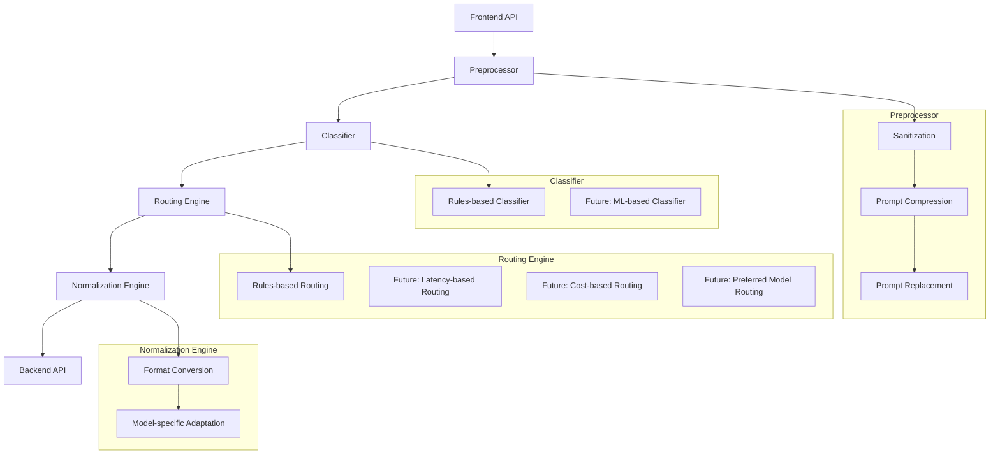

# NeuroRoute Flow Architecture Guide

## Table of Contents

- [NeuroRoute Flow Architecture Guide](#neuroroute-flow-architecture-guide)
  - [Table of Contents](#table-of-contents)
  - [Introduction](#introduction)
  - [Architecture Overview](#architecture-overview)
  - [Components](#components)
    - [Preprocessor](#preprocessor)
      - [Key Features](#key-features)
      - [Architecture](#architecture)
      - [Usage](#usage)
    - [Classifier](#classifier)
      - [Key Features](#key-features-1)
      - [Architecture](#architecture-1)
      - [Usage](#usage-1)
    - [Routing Engine](#routing-engine)
      - [Key Features](#key-features-2)
      - [Architecture](#architecture-2)
      - [Usage](#usage-2)
    - [Normalization Engine](#normalization-engine)
      - [Key Features](#key-features-3)
      - [Architecture](#architecture-3)
      - [Usage](#usage-3)
  - [Flow Process](#flow-process)
  - [Integration Points](#integration-points)
  - [Usage Examples](#usage-examples)
    - [Basic Usage](#basic-usage)
    - [Advanced Usage with Custom Components](#advanced-usage-with-custom-components)
  - [Extending the Architecture](#extending-the-architecture)
    - [Adding a New Preprocessor](#adding-a-new-preprocessor)
    - [Creating a Custom Classifier](#creating-a-custom-classifier)
    - [Implementing a New Routing Strategy](#implementing-a-new-routing-strategy)
    - [Adding a Model-Specific Normalizer](#adding-a-model-specific-normalizer)
  - [Performance Considerations](#performance-considerations)
  - [Best Practices](#best-practices)
  - [Troubleshooting](#troubleshooting)
    - [Common Issues](#common-issues)
    - [Debugging](#debugging)

## Introduction

The NeuroRoute Flow Architecture is a pipeline-based system designed to process and route prompts to the most appropriate language model. This architecture improves the system's flexibility, modularity, and extensibility, allowing for easier addition of new components and capabilities.

The flow follows a sequential process:

```
Frontend API → Preprocessor → Classifier → Routing Engine → Normalization Engine → Backend API
```

This guide provides comprehensive documentation for developers working with the NeuroRoute API, explaining each component, their integration points, and how to extend the architecture with custom implementations.

## Architecture Overview

The flow architecture is designed around the following principles:

- **Modularity**: Each component has a clear, single responsibility
- **Extensibility**: New preprocessors, classifiers, routing strategies, and normalizers can be added without modifying existing code
- **Testability**: Each component can be tested in isolation
- **Flexibility**: Different components can be swapped in and out based on requirements
- **Future-proofing**: The architecture can accommodate new features and requirements as they arise

The architecture is visualized in the following diagram:



## Components

### Preprocessor

The Preprocessor is responsible for handling initial prompt processing before it's passed to the classifier. It's designed with a plugin architecture to allow for easy extension with new processors.

#### Key Features

- **Sanitization**: Removes harmful content, normalizes text
- **Prompt Compression**: Reduces prompt size if needed
- **Prompt Replacement**: Substitutes tokens or patterns

#### Architecture

The Preprocessor Service follows a plugin-based architecture where each preprocessor is a separate module that can be registered with the service. The service then processes prompts through all enabled preprocessors in the order they were registered.

- **PreprocessorService**: The main entry point for the service, responsible for registering preprocessors and processing prompts.
- **PreprocessorRegistry**: Manages the collection of registered preprocessors.
- **Preprocessor**: Interface that all preprocessors must implement.
- **Processors**: Individual preprocessor implementations (sanitization, compression, replacement).

#### Usage

```typescript
import { createPreprocessorService } from './services/preprocessor';

// Create the service
const preprocessorService = createPreprocessorService();

// Process a prompt
const processedPrompt = await preprocessorService.process('Your prompt here', {
  // Options for the preprocessors
  sanitization: {
    enabled: true,
    removeHtmlTags: true,
    removeScriptTags: true,
    removeUrls: false,
    removeEmails: false,
    removePersonalInfo: false
  },
  compression: {
    enabled: false
  },
  replacement: {
    enabled: false
  }
});
```

### Classifier

The Classifier analyzes prompts to determine their characteristics, such as intent, complexity, and required features. It uses a plugin architecture that allows for different classifier implementations.

#### Key Features

- **Rules-based Classification**: Uses predefined rules to classify prompts
- **Future: ML-based Classification**: Will use machine learning models for more accurate classification

#### Architecture

The classifier service consists of the following components:

- **Interfaces**: Defines the contract for classifier implementations
- **Registry**: Manages classifier implementations and provides a unified API
- **Classifiers**: Individual classifier implementations (rules-based, ML-based, etc.)

#### Usage

```typescript
import { createClassifierService } from './services/classifier';

// Create the classifier service
const classifierService = createClassifierService(fastify);

// Classify a prompt
const result = await classifierService.classifyPrompt('Write a function to calculate Fibonacci numbers');
console.log(result);
// {
//   type: 'code',
//   complexity: 'medium',
//   features: ['code-generation'],
//   priority: 'medium',
//   confidence: 0.85,
//   tokens: { estimated: 15, completion: 50 },
//   language: 'javascript'
// }
```

### Routing Engine

The Routing Engine determines which model/backend to use based on the prompt classification and various routing strategies.

#### Key Features

- **Rules-based Routing**: Uses predefined rules to select a model
- **Future: Latency-based Routing**: Will select models based on latency considerations
- **Future: Cost-based Routing**: Will select models based on cost considerations
- **Future: Preferred Model Routing**: Will respect user preferences for model selection

#### Architecture

The Routing Engine is part of the refactored Router Service and consists of:

- **RoutingEngine**: The main entry point for routing
- **RoutingStrategy**: Interface for routing strategy implementations
- **Strategies**: Individual routing strategy implementations (rules-based, latency-based, etc.)

#### Usage

```typescript
import { createRoutingEngine } from './services/router/routing';

// Create the routing engine
const routingEngine = createRoutingEngine();

// Route a prompt
const routingResult = await routingEngine.route(
  'Write a function to calculate Fibonacci numbers',
  classification, // From the classifier
  {
    costOptimize: false,
    qualityOptimize: true,
    latencyOptimize: false
  }
);

console.log(routingResult);
// {
//   modelId: 'gpt-4-turbo-latest',
//   provider: 'openai',
//   confidence: 0.9,
//   reason: 'Selected based on code generation capability and quality optimization'
// }
```

### Normalization Engine

The Normalization Engine prepares the prompt for the selected backend, including format conversion and model-specific adaptations.

#### Key Features

- **Format Conversion**: Adapts to backend-specific formats
- **Model-specific Adaptation**: Adjusts prompts for specific models

#### Architecture

The Normalization Engine is part of the refactored Router Service and consists of:

- **NormalizationEngine**: The main entry point for normalization
- **Normalizer**: Interface for normalizer implementations
- **Normalizers**: Individual normalizer implementations for different models (OpenAI, Anthropic, etc.)

#### Usage

```typescript
import { createNormalizationEngine } from './services/router/normalization';

// Create the normalization engine
const normalizationEngine = createNormalizationEngine();

// Normalize a prompt for a specific model
const normalizedPrompt = await normalizationEngine.normalize(
  'Write a function to calculate Fibonacci numbers',
  'gpt-4-turbo-latest',
  {
    formatForModel: true,
    preserveFormatting: true
  }
);

console.log(normalizedPrompt);
// The prompt formatted specifically for GPT-4 Turbo
```

## Flow Process

The complete flow process follows these steps:

1. **Frontend API**: The prompt is received by the API endpoint (`/prompt`)
2. **Preprocessor**: The prompt is processed by the Preprocessor Service
   - Sanitization removes harmful content
   - Prompt compression reduces size if needed
   - Prompt replacement substitutes tokens or patterns
3. **Classifier**: The processed prompt is analyzed by the Classifier Service
   - Determines the prompt's intent, complexity, and required features
   - Estimates token usage
4. **Routing Engine**: The classification is used by the Routing Engine to select a model
   - Considers routing options (cost, quality, latency)
   - Selects the most appropriate model
5. **Normalization Engine**: The prompt is normalized for the selected model
   - Converts the format to match the model's requirements
   - Applies model-specific adaptations
6. **Backend API**: The normalized prompt is sent to the selected LLM service
   - The response is returned to the client

Each step in the process is monitored for performance and errors, with detailed logging throughout the flow.

## Integration Points

The flow architecture has several integration points where components interact:

1. **Preprocessor → Classifier**: The preprocessed prompt is passed to the classifier
2. **Classifier → Routing Engine**: The classification result is passed to the routing engine
3. **Routing Engine → Normalization Engine**: The selected model ID is passed to the normalization engine
4. **Normalization Engine → Backend API**: The normalized prompt is passed to the selected model adapter

These integration points are designed to be clean and well-defined, with clear interfaces between components.

## Usage Examples

### Basic Usage

```typescript
import { FastifyInstance } from 'fastify';
import { createPreprocessorService } from './services/preprocessor';
import { createClassifierService } from './services/classifier';
import { createRoutingEngine } from './services/router/routing';
import { createNormalizationEngine } from './services/router/normalization';
import { getModelAdapter } from './models/adapter-registry';

export async function promptHandler(fastify: FastifyInstance) {
  // Create services
  const preprocessor = createPreprocessorService();
  const classifier = createClassifierService(fastify);
  const routingEngine = createRoutingEngine();
  const normalizationEngine = createNormalizationEngine();

  // Register route
  fastify.post('/prompt', async (request, reply) => {
    const { prompt, model_id, routingOptions, normalizationOptions } = request.body;
    
    try {
      // Step 1: Preprocess the prompt
      const preprocessedPrompt = await preprocessor.process(prompt);
      
      // Step 2: Classify the prompt
      const classification = await classifier.classifyPrompt(preprocessedPrompt);
      
      // Step 3: Route to the appropriate model
      const routingResult = await routingEngine.route(
        preprocessedPrompt,
        classification,
        routingOptions
      );
      
      // Use model_id override if provided
      const modelId = model_id || routingResult.modelId;
      
      // Step 4: Normalize the prompt for the selected model
      const normalizedPrompt = await normalizationEngine.normalize(
        preprocessedPrompt,
        modelId,
        normalizationOptions
      );
      
      // Step 5: Get the model adapter and generate completion
      const modelAdapter = getModelAdapter(fastify, modelId);
      const response = await modelAdapter.generateCompletion(normalizedPrompt);
      
      // Return the response
      return {
        response: response.text,
        model_used: modelId,
        tokens: response.tokens,
        processing_time: {
          preprocessing: /* timing metrics */,
          classification: /* timing metrics */,
          routing: /* timing metrics */,
          normalization: /* timing metrics */,
          model_generation: /* timing metrics */,
          total: /* timing metrics */
        },
        classification: {
          intent: classification.type,
          confidence: classification.confidence,
          features: classification.features,
          domain: classification.domain
        },
        request_id: request.id
      };
    } catch (error) {
      // Handle errors
      fastify.log.error(error);
      return reply.code(500).send({
        error: error.message,
        code: 'PROMPT_PROCESSING_ERROR',
        request_id: request.id
      });
    }
  });
}
```

### Advanced Usage with Custom Components

```typescript
import { FastifyInstance } from 'fastify';
import { createPreprocessorService } from './services/preprocessor';
import { createClassifierService } from './services/classifier';
import { createRoutingEngine } from './services/router/routing';
import { createNormalizationEngine } from './services/router/normalization';
import { getModelAdapter } from './models/adapter-registry';
import { createMyCustomPreprocessor } from './services/preprocessor/processors/my-custom';
import { createMlBasedClassifier } from './services/classifier/classifiers/ml-based';
import { createLatencyBasedStrategy } from './services/router/routing/strategies/latency-based';
import { createAnthropicNormalizer } from './services/router/normalization/normalizers/anthropic';

export async function setupCustomFlow(fastify: FastifyInstance) {
  // Create services
  const preprocessor = createPreprocessorService();
  const classifier = createClassifierService(fastify);
  const routingEngine = createRoutingEngine();
  const normalizationEngine = createNormalizationEngine();
  
  // Register custom preprocessor
  const myCustomPreprocessor = createMyCustomPreprocessor();
  preprocessor.registerPreprocessor(myCustomPreprocessor);
  
  // Register custom classifier
  const mlClassifier = createMlBasedClassifier();
  classifier.registry.register(mlClassifier);
  classifier.registry.setDefault(mlClassifier.name);
  
  // Register custom routing strategy
  const latencyStrategy = createLatencyBasedStrategy();
  routingEngine.registerStrategy(latencyStrategy);
  
  // Register custom normalizer
  const anthropicNormalizer = createAnthropicNormalizer();
  normalizationEngine.registerNormalizer('claude', anthropicNormalizer);
  
  // Now the flow will use your custom components
}
```

## Extending the Architecture

The flow architecture is designed to be easily extensible. Here's how to add new components:

### Adding a New Preprocessor

To create a new preprocessor, implement the `Preprocessor` interface:

```typescript
import { Preprocessor, PreprocessorOptions } from './interfaces';

export function createMyPreprocessor(): Preprocessor {
  return {
    name: 'my-preprocessor',
    
    isEnabled(options?: PreprocessorOptions): boolean {
      return options?.myPreprocessor?.enabled === true;
    },
    
    async process(prompt: string, options?: PreprocessorOptions): Promise<string> {
      // Your preprocessing logic here
      return prompt;
    }
  };
}
```

Then register it with the service:

```typescript
import { createPreprocessorService } from './services/preprocessor';
import { createMyPreprocessor } from './services/preprocessor/processors/my-preprocessor';

const preprocessorService = createPreprocessorService();
preprocessorService.registerPreprocessor(createMyPreprocessor());
```

### Creating a Custom Classifier

To create a custom classifier, implement the `Classifier` interface:

```typescript
import { Classifier, ClassifierOptions, ClassifiedIntent } from '../interfaces';

export function createMyCustomClassifier(): Classifier {
  return {
    name: 'my-custom-classifier',
    
    isEnabled(): boolean {
      return true;
    },
    
    async classify(prompt: string, options?: ClassifierOptions): Promise<ClassifiedIntent> {
      // Your classification logic here
      return {
        type: 'general',
        complexity: 'medium',
        features: ['text-generation'],
        priority: 'medium',
        confidence: 0.7,
        tokens: {
          estimated: Math.ceil(prompt.length / 4),
          completion: Math.ceil(prompt.length / 4)
        }
      };
    }
  };
}
```

Then register it with the service:

```typescript
import { createClassifierService } from './services/classifier';
import { createMyCustomClassifier } from './services/classifier/classifiers/my-custom';

const classifierService = createClassifierService(fastify);
const myClassifier = createMyCustomClassifier();
classifierService.registry.register(myClassifier);
classifierService.registry.setDefault(myClassifier.name);
```

### Implementing a New Routing Strategy

To create a new routing strategy, implement the `RoutingStrategy` interface:

```typescript
import { RoutingStrategy, RoutingOptions, RoutingResult, ClassifiedIntent } from '../interfaces';

export function createMyRoutingStrategy(): RoutingStrategy {
  return {
    name: 'my-routing-strategy',
    
    isEnabled(options?: RoutingOptions): boolean {
      return options?.myStrategy?.enabled === true;
    },
    
    async route(prompt: string, classification: ClassifiedIntent, options?: RoutingOptions): Promise<RoutingResult> {
      // Your routing logic here
      return {
        modelId: 'gpt-4-turbo-latest',
        provider: 'openai',
        confidence: 0.8,
        reason: 'Selected based on custom routing strategy'
      };
    }
  };
}
```

Then register it with the routing engine:

```typescript
import { createRoutingEngine } from './services/router/routing';
import { createMyRoutingStrategy } from './services/router/routing/strategies/my-strategy';

const routingEngine = createRoutingEngine();
routingEngine.registerStrategy(createMyRoutingStrategy());
```

### Adding a Model-Specific Normalizer

To create a model-specific normalizer, implement the `Normalizer` interface:

```typescript
import { Normalizer, NormalizationOptions } from '../interfaces';

export function createMyModelNormalizer(): Normalizer {
  return {
    name: 'my-model-normalizer',
    
    isEnabled(options?: NormalizationOptions): boolean {
      return options?.myNormalizer?.enabled === true;
    },
    
    async normalize(prompt: string, modelId: string, options?: NormalizationOptions): Promise<string> {
      // Your normalization logic here
      return `Normalized for ${modelId}: ${prompt}`;
    }
  };
}
```

Then register it with the normalization engine:

```typescript
import { createNormalizationEngine } from './services/router/normalization';
import { createMyModelNormalizer } from './services/router/normalization/normalizers/my-model';

const normalizationEngine = createNormalizationEngine();
normalizationEngine.registerNormalizer('my-model', createMyModelNormalizer());
```

## Performance Considerations

The flow architecture includes several performance optimizations:

1. **Caching**: Responses can be cached to reduce computation and API calls
2. **Asynchronous Processing**: Components operate asynchronously for better performance
3. **Performance Metrics**: Each stage of the flow records timing metrics
4. **Optimized Token Counting**: Efficient token counting to avoid unnecessary API calls
5. **Selective Processing**: Preprocessors and other components can be selectively enabled/disabled

When implementing custom components, consider the following:

- **Minimize Computation**: Keep preprocessing and classification logic efficient
- **Avoid Blocking Operations**: Use asynchronous operations where possible
- **Implement Caching**: Cache results where appropriate
- **Profile Performance**: Monitor and optimize performance bottlenecks

## Best Practices

When working with the flow architecture, follow these best practices:

1. **Component Isolation**: Keep components isolated and focused on their specific responsibilities
2. **Clear Interfaces**: Define clear interfaces between components
3. **Error Handling**: Implement proper error handling in each component
4. **Logging**: Use the logger for debugging and monitoring
5. **Testing**: Write unit tests for each component and integration tests for the complete flow
6. **Documentation**: Document your custom components and their behavior
7. **Configuration**: Use configuration options to control component behavior
8. **Versioning**: Version your custom components to track changes

## Troubleshooting

### Common Issues

1. **Preprocessor Errors**
   - Check that preprocessor options are correctly configured
   - Verify that the prompt is valid and not too large
   - Check for errors in custom preprocessors

2. **Classification Errors**
   - Ensure the classifier is properly registered
   - Check that the classification logic is working correctly
   - Verify that the prompt is properly preprocessed

3. **Routing Errors**
   - Check that routing strategies are correctly implemented
   - Verify that the classification result is valid
   - Ensure that routing options are properly configured

4. **Normalization Errors**
   - Check that normalizers are registered for the selected model
   - Verify that the normalization logic is working correctly
   - Ensure that the prompt is valid for the selected model

5. **Performance Issues**
   - Check for bottlenecks in the flow
   - Verify that caching is properly configured
   - Ensure that components are not doing unnecessary work

### Debugging

To debug issues in the flow architecture:

1. **Enable Debug Logging**
   ```typescript
   fastify.log.level = 'debug';
   ```

2. **Trace the Flow**
   ```typescript
   // Add tracing to each component
   const preprocessedPrompt = await preprocessor.process(prompt);
   fastify.log.debug({ preprocessedPrompt }, 'Preprocessed prompt');
   
   const classification = await classifier.classifyPrompt(preprocessedPrompt);
   fastify.log.debug({ classification }, 'Classification result');
   
   // ... and so on
   ```

3. **Test Components in Isolation**
   ```typescript
   // Test preprocessor
   const preprocessorService = createPreprocessorService();
   const result = await preprocessorService.process('Test prompt');
   console.log(result);
   ```

4. **Use Integration Tests**
   - Run the integration tests to verify the complete flow
   - Check for errors in the test output
   - Verify that the flow is working as expected