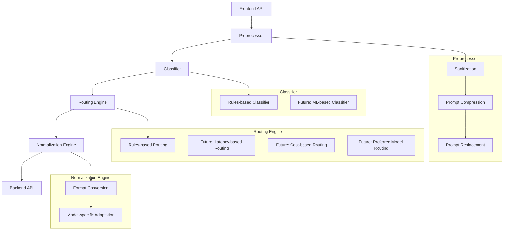

# NeuroRoute Prompt Flow Architecture

## Flow Description

1. **Frontend API**: The entry point for all prompt requests
2. **Preprocessor**: Handles initial prompt processing
   - Sanitization: Removes harmful content, normalizes text
   - Prompt Compression: Reduces prompt size if needed
   - Prompt Replacement: Substitutes tokens or patterns
3. **Classifier**: Analyzes the prompt to determine its characteristics
   - Currently uses a rules-based classifier
   - Future: Could use ML-based classification
4. **Routing Engine**: Determines which model/backend to use
   - Currently uses rules-based routing
   - Future: Could consider latency, cost, or user preferences
5. **Normalization Engine**: Prepares the prompt for the selected backend
   - Format Conversion: Adapts to backend-specific formats
   - Model-specific Adaptation: Adjusts prompts for specific models
6. **Backend API**: The actual LLM service (OpenAI, Anthropic, etc.)